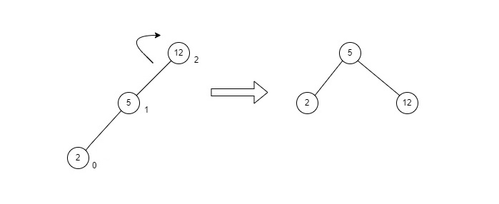
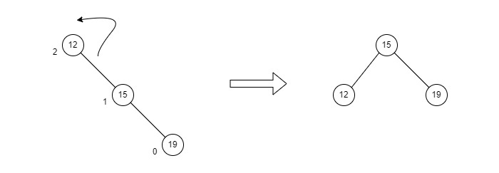
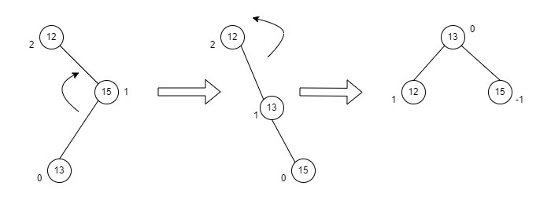

# Data Structures

A **data structure** is a container used to store and organize data. They are used to arrange data on a computer for efficient access and updates. We previously introduced the basic concepts and types of data structures, as well as our implementations in C++ of common linear data structures, such as a **Stack**, a **Queue**, a **Circular Queue**, a **Linked List** and a **Hash Table**. Please refer to the repo [linear_data_structures](https://github.com/alan-xavier-16/linear_data_structures) for details.

In this repo, we will implement the **Tree** data structures.

## Tree Data Structures

A tree is a `nonlinear` hierarchical data structure that consists of **nodes** connected by **edges**.

Other data structures, such as arrays, linked lists, stacks, and queues are `linear` data structures that store data **sequentially**. The time complexity for any operations performed on a linear data structure increases with the increase in the data size stored by these structures.

Tree data structures allow for quicker and easier access to the data is not in any sequence, but arranged in a hierarchical manner, where one element is connected to one or more elements.

## Tree Terminologies

1. `Node`:
   - A node is an entity that contains a **key or value** and **pointers** to its child nodes.
   - The **last** nodes of each path are called **leaf nodes** that do not point to child nodes.
   - The node having at least a child node is called an **internal** node.
2. `Edge`: The link between any two nodes.
3. `Root`: The topmost node of a tree.
4. `Height of a Node`: The number of edges from the node to the deepest leaf (i.e. the longest path from the node to a leaf node).
5. `Depth of a Node`: The number of edges from the root to the node.
6. `Height of a Tree`: The height of the root node or the depth of the deepest node.
7. `Degree of a Node`: The total number of branches of that node.
8. `Forest`: A collection of disjoint trees.

|  |
| -------------------------------------------------------------- |

## Tree Traversal

Traversing a tree means visiting every node in the tree. For example, to add all the values in the tree or to find the largest node requires visiting each node of the tree.

Linear data structures, like arrays, stacks, queues, and linked lists have only **one** way to read the data. Hierarchical data structure such as trees, however, can be traversed in different ways.

We use traversal methods that take into account the **basic structure of a tree**. A node of a tree may be represented as a `struct` in C++, i.e.

```C++
struct node {
    int data;
    struct node* left;
    struct node* right;
}
```

The `struct node` pointed to by **left and right pointers** may lead to other `struct nodes` with **left and right children (pointers)**, so these nodes can be thought of as sub-trees instead of sub-nodes.

Every tree is thus a combination of:

- A node carrying **data**
- **Two subtrees**

To visit each node, we need to visit all the nodes in the left subtree, visit the root node and visit all the nodes in the right subtree. Depending on the order in which we do this, there can be three types of traversal.

### Inorder traversal

1. Visit all the nodes in the left subtree,
2. Visit the root node,
3. Visit all the nodes in the right subtree.

### Preorder traversal

1. Visit root node,
2. Visit all the nodes in the left subtree,
3. Visit all the nodes in the right subtree.

### Postorder traversal

1. Visit all the nodes in the left subtree,
2. Visit all the nodes in the right subtree,
3. Visit the root node.

## Binary Tree

A binary tree is a tree data structure where each parent node can have at most two child nodes. Each node of a binary tree consists of three items:

- Its data,
- Address of left child,
- Address of right child.

### Full Binary Tree

A full binary tree is a binary tree where every internal node has either two or no children. It is also known as a `proper binary tree`.

|  |
| ------------------------------------------------------ |

Let `i` be the number of `internal` nodes, `n` be the total number of `nodes`, `l` be the number of `leaves`, and `L` be the number of `levels`. We can then determine:

- The **number of leaves** as `l = i + 1`.
- The **total number of nodes** as `n = 2i + 1`.
- The **number of internal nodes** as `i = (n – 1) / 2`.
- The **number of leaves** as `l = (n + 1) / 2`.
- The **total number of nodes** as `n = 2l – 1`.
- The **number of internal nodes** as `i = l – 1`.
- The **number of leaves** as at most `l = 2^(L - 1)`.

### Perfect Binary Tree

A perfect binary tree is a binary tree where every internal node has exactly two children and all the leaf nodes are on the same level, i.e. all the internal nodes have a degree of 2.

|  |
| ------------------------------------------------------------ |

A perfect binary tree can be defined as:

- If a single node has no children, it is a perfect binary tree of height `h = 0`.
- If a node has `h > 0`, it is a perfect binary tree if both of its subtrees are of height `h - 1` and are non-overlapping.
- The **total number of nodes** is `n = 2^(h + 1) - 1`.
- The **number of leaves** is `l = 2^h`.
- The **number of internal nodes** is `i = 2^h - 1`.

### Complete Binary Tree

A complete binary tree is a binary tree where all the levels are completely full, except possibly the deepest level, which can have nodes that have either one left child or can be completely full.

It is similar to a full binary tree, except:

- All the leaves must lean towards the left.
- The last leaf may not have a right sibling, i.e. a complete binary tree doesn't have to be a full binary tree.

|  |
| -------------------------------------------------------------- |

#### Create a Complete Binary Tree

Given an array of six elements -> `1 | 2 | 3 | 4 | 5 | 6`,

- Select the **first** element to be the **root** node, no. of elements on level `L-1 = 1`.
- Place the **second** element as a **left** child and the **third** element as the **right** child, no. of elements on level `L-2 = 2`.
- Put the **next two elements as children of the left node** of the second level. Then, put the next **two elements as children of the right node** of the second level, no. of elements on level `L-3 = 4`.
- Repeat until the last element.

#### Relationship between array indexes and tree element

A complete binary tree has an interesting relationship that can be used to find the **children and parents of any node**. If the index of any element in the array is `i`,

- The element at index `2i+1` will become the **left child** and,
- The element at index `2i+2` index will become the **right child**. 
- The **parent** of any element at index `i` is given by the lower bound of `(i-1)/2`.

### Degenerate or Pathological Tree

A degenerate or pathological binary tree is a tree having a single child either left or right.

|  |
| ------------------------------------------------------------------ |

### Skewed Binary Tree

A skewed binary tree is a pathological/degenerate tree where the tree is dominated by either left or right nodes. Thus, there are two types of skewed binary tree: **left-skewed** and **right-skewed** binary trees.

|  |
| ----------------------------------------------------------- |

### Balanced Binary Tree

A balanced binary tree is a binary tree where the difference between the height of the left and the right subtree for each node is either 0 or 1. It is also referred to as a `height-balanced binary tree`.

|  |
| -------------------------------------------------------------- |

The conditions for a height-balanced binary tree are:

- The difference between the left and the right subtree for any node is **not more than 1**.
- The left subtree is **balanced**.
- The right subtree is **balanced**.

## Binary Search Tree(BST)

A binary search tree is a data structure that quickly maintains the order of a sorted list of numbers. It is a **binary tree** because each tree node has a maximum of two children. It is also called a **search tree** because it can be used to search for the presence of a number in `O(log(n))` time.

The properties that separate a binary search tree from a regular binary tree is:

- All nodes of **left** subtree are **less** than the **root** node,
- All nodes of **right** subtree are **more** than the **root** node,
- Both subtrees of each node are also BSTs i.e. they have the above two properties.

### Operations of BST Trees

#### Search Operation

This algorithm depends on the property of BST where each left subtree has values **below** the root and each right subtree has values **above** the root. If the value is below the root, then the value is not in the right subtree and we only need to search in the left subtree. If the value is above the root, then the value is not in the left subtree and we only need to search in the right subtree.

```C++
If (root == NULL) 
    return NULL;
If (number == root->data) 
    return root->data;
If (number < root->data)
    return search(root->left)
If (number > root->data) 
    return search(root->right)
```

#### Insert Operation

When inserting a value in the correct position, we must maintain the rule that the left subtree is **lesser** than the root and the right subtree is **larger** than the root. Depending on the value, we move to either right or left subtree and when we reach a point where the left or right subtree is null, we put the new node there.

```C++
If (node == NULL) 
    return createNode(data)
If (data < node->data)
    node->left = insert(node->left, data);
Else if (data > node->data)
    node->right = insert(node->right, data);  
return node;
```

#### Deletion Operation

There are three cases to consider when deleting a node from a binary search tree.

1. `Case I`: The node to be deleted is a leaf node and can simply be deleted from the tree.
2. `Case II`: The node to be deleted has a single child node. In such a case, we (1) replace that node with its child node, then (2) remove the child node from its original position.
3. `Case III`: The node to be deleted has two children. In such a case, we (1) get the inorder successor of that node, then (2) replace the node with the inorder successor and (3) remove the inorder successor from its original position. **Note**: Inorder Successor of a given node is the node with the smallest value greater than the value of the given node.

### Binary Search Tree Complexities

#### Time Complexity

| Operation | Best Case Complexity | Average Case Complexity | Worst Case Complexity |
| --------- | -------------------- | ----------------------- | --------------------- |
| Search    | `O(log n)`           | `O(log n)`              | `O(n)`                |
| Insertion | `O(log n)`           | `O(log n)`              | `O(n)`                |
| Deletion  | `O(log n)`           | `O(log n)`              | `O(n)`                |

Here, `n` is the number of nodes in the tree.

#### Space Complexity

The space complexity for all the operations is `O(n)`.

## AVL Tree

An AVL tree is a `self-balancing` binary search tree where each node maintains extra information called a **balance factor** with a value of `-1, 0 or +1`. The self balancing property is maintained by the balance factor.

### Balance Factor

The balance factor of a node in an AVL tree is the difference between the `height of the left subtree and the height of the right subtree` of the given node.

```C++
Balance Factor = (Height of Left Subtree - Height of Right Subtree)
```

An AVL Tree has the following operations:

### Rotations

Rotations are used to maintain the self-balancing of AVL trees. The four cases of rotations are:

#### LL Rotations

Performed when a node is inserted into the `right subtree of the right subtree` leading to an unbalanced tree. A `single` left rotation is used to rebalance the tree. Observe:

- The node where the unbalance occurs becomes the **left** child,
- The newly added node becomes the **right** child,
- The middle node becomes the **parent** node.

|  |
| ------------------------------------------ |

#### RR Rotations

Performed when a node is inserted into the `left subtree of the left subtree` leading to an unbalanced tree. A `single` right rotation is used to rebalance the tree. Observe:

- The node where the unbalance occurs becomes the **right** child,
- The newly added node becomes the **left** child,
- The middle node the **parent** node.

|  |
| ------------------------------------------ |

#### LR Rotations

LR rotations are called a `double rotation` and is performed when a node is inserted into the `right subtree of the left subtree`. It is a combination of the `left rotation followed by the right rotation`. Consider the example below, to rebalance the tree:

- The unbalance occurs at 13, and a **left rotation** is applied on the child nodes of 13, i.e. 11 and 12.
- Afterwards, the 12 node becomes the left child of 13 and 11 becomes the left child of 12.
- Since the unbalance still persists, a **right rotation** is applied at the root node 13 and the left child 12.
- After the final right rotation, 12 becomes the root node, 13 becomes the right child and 11 is the left child.

|  |
| ------------------------------------------ |

#### RL Rotations

RL rotation are called a `double rotation` and is performed when a node is inserted into the `left subtree of the right subtree`. It is a combination of the `right rotation followed by the left rotation`. Consider the example below, to rebalance the tree:

- The unbalance occurs at 12, a **right rotation** is applied on the child nodes of 12, i.e. 15 and 13.
- Afterwards, the 13 node becomes the right child of 12 and 15 becomes the right child of 13.
- Since the unbalance still persists, a **left rotation** is applied at the root node 12 and the right child 13.
- After the final left rotation, 13 becomes the root node, 12 becomes the left child and 15 is the right child.

|  |
| ------------------------------------------ |

### Operations of AVL Trees

Since AVL Trees are binary search trees, they possess all the operations associated with BSTs while holding all its properties. However, **Insertion** and **Deletion** can result in an **unbalanced** AVL tree.

#### Insertion

Inserting into an AVL Tree follows the BST property of insertion where the left subtree contains elements less than the root value and right subtree contains elements greater than the root value. However, after insertion, the balance factor must be checked. If the balance factor is not `-1, 0 or 1`, a balancing algorithm is applied to rebalance the tree.

During the insertion operation:

1. A `newNode` is inserted as a leaf node with balance factor of 0.
2. If the tree is empty, the new node becomes the root node.
3. However, if the tree is not empty, we move to the appropriate `leafNode` by comparing the `newKey` with `rootKey` of the current tree.
    - If `newKey < rootKey`, call the insertion algorithm on the left subtree of the current node until the leaf node is reached.
    - Else if `newKey > rootKey`, call the insertion algorithm on the right subtree of current node until the leaf node is reached.
    - Else, return the `leafNode`.
4. Compare `leafKey` obtained from the above steps with `newKey`:
    - If `newKey < leafKey`, make newNode as the `leftChild` of leafNode.
    - Else, make newNode as `rightChild` of leafNode.
5. Update `balanceFactor` of the nodes.
6. If the nodes are **unbalanced**, then **rebalance** the node.
    - If `balanceFactor > 1`, the height of the left subtree is greater than that of the right subtree, so a `RR rotation or LR rotation` is needed.
        - If `newNodeKey < leftChildKey` do **RR rotation**.
        - Else, do **LR rotation**.
    - If `balanceFactor < -1`, the height of the right subtree is greater than that of the left subtree, so do a `LL rotation or RL rotation`
        - If `newNodeKey > rightChildKey` do **LL rotation**.
        - Else, do **RL rotation**.

## References

1. [Programiz Tree Data Structures](https://www.programiz.com/dsa/binary-tree)
2. [Tutorials Point Data Structures](https://www.tutorialspoint.com/data_structures_algorithms/avl_tree_algorithm.htm)
